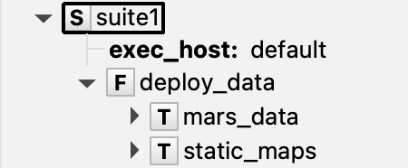

# Data deployment

## Static data store

The [wellies.StaticDataStore][] is a collection class to instantiate a dict-like
configuration of multiple entries of static datasets.

With a `static_data` section in your yaml configuration file like the one below,
you can easily define and share different data preparation tasks for your workflow.

```yaml title="data.yaml"
static_data:
    mars_data:
        type: mars
        request:
          class: od
          type: an
          expver: "1"
          date: "19990215"
          time: "12"
          param: t
          levtype: "pressure level"
          levelist: [1000, 850, 700, 500]
          target: t.grb
        post_script: "pproc-interpol --grid SMUFF-OPERA-2km-proj t.grb t_2km.grb"
    static_maps:
        type: ecfs
        source: ec:/arch/static/
        files: [dem.grib, landcover.grib]
        post_script: "echo 'Copy Done'"
```

```python exec="true" session="deploy_data"
content='''
static_data:
    mars_data:
        type: mars
        request:
          class: od
          type: an
          expver: "1"
          date: "19990215"
          time: "12"
          param: t
          levtype: "pressure level"
          levelist: [1000, 850, 700, 500]
          target: t.grb
        post_script: "pproc-interpol --grid SMUFF-OPERA-2km-proj t.grb t_2km.grb"
    static_maps:
        type: ecfs
        source: ec:/arch/static/
        files: [dem.grib, landcover.grib]
        post_script: "echo 'Copy Done'"
'''
import os, tempfile
tmpdirname = tempfile.mkdtemp()
with open(f"{tmpdirname}/data.yaml", 'w') as fdata:
  fdata.write(content)
```

Then, the code to go from the configuration file to the [wellies.StaticDataStore][],
including all the retrieval scripts, will look like:

```python exec="true" source="above" result="python" session="deploy_data"
import os; curdir=os.getcwd(); os.chdir(tmpdirname)  # markdown-exec: hide

import yaml
from wellies import StaticDataStore
with open("data.yaml", 'r') as fdata:
    options = yaml.safe_load(fdata)
os.chdir(curdir)  # markdown-exec: hide
sdata_store = StaticDataStore("$DATA_DIR", options["static_data"])
print(sdata_store)
```

## Deploy data family

An instance of a [wellies.StaticDataStore][] can be directly used with the
[wellies.DeployDataFamily][] to create a fully defined data retrieval Family on
a [pyflow.Suite][].

```python exec="true" source="above" session="deploy_data" result="shell"
from wellies import DeployDataFamily
from pyflow import Suite

with Suite(name='suite1', files="."):
  node=DeployDataFamily(sdata_store)

print(node)
```

Which in ecFlowUI will look like



The resulting script, for example, for the task `static_maps` will be:

```python exec="true" title="static_maps.ecf" session="deploy_data" result="shell"
script, includes = node.static_maps.generate_script()
script = '\n'.join(script)
print(f"{script}")
```

To know more about the scripts content and how to tune different options, please
check the [data config page](data_config.md)
