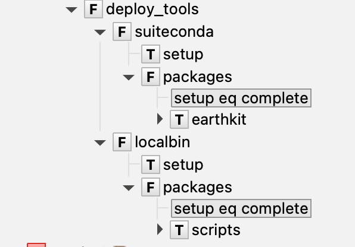

# Tools deployment

## Tool Store

The [wellies.ToolStore][] is a collection class to instantiate and resolve
the tools configuration interaction. It also helps the handling of the different
tools that a suite Task might need at execution time through the `load` and
`unload` methods.

Considering a full feature `tools` configuration as below, we can explore how
the `ToolStore` makes setting up different execution environments easy.

```yaml title="tools.yaml"
tools:
  modules:
    conda:
      version: "22.11.1-2"
    toolbox:
      name: ecmwf-toolbox
      version: new

  packages:
    earthkit:
      type: "git"
      source: "git@github.com:ecmwf/earthkit-data.git"
      branch: master
      post_script: [
        "pip install .",
        ""pip show src | grep Version > version.txt",
      ]

  scripts:
      type: "rsync"
      source: "hpc-login:/path/to/project"
      post_script: "chmod ug+rx,o+r $ENV/*.sh $ENV/*.py"

  env_vars:
    PYTHONPATH: "$LIB_DIR/localbin"

  environments:
    suiteconda:
      type: conda
      depends: ["conda"]
      packages: ["earthkit"]
      extra_packages: ["python>=3.12"]
    localbin:
      type: folder
      depends: ["toolbox", "PYTHONPATH"]
      packages: ["scripts"]
```

```python exec="true" session="deploy_tools"
content='''
tools:
  modules:
    conda:
      version: "22.11.1-2"
    toolbox:
      name: ecmwf-toolbox
      version: new
  packages:
    earthkit:
      type: "git"
      source: "git@github.com:ecmwf/earthkit-data.git"
      branch: master
      post_script: [
        "pip install .",
        "pip show src | grep Version > version.txt"
    ]
    scripts:
      type: "rsync"
      source: "hpc-login:/path/to/project"
      post_script: "chmod ug+rx,o+r $ENV/*.sh $ENV/*.py"
  env_variables:
    PYTHONPATH:
      value: "$LIB_DIR/localbin"
  environments:
    suiteconda:
      type: conda
      depends: ["conda"]
      packages: ["earthkit"]
      extra_packages: ["python>=3.12"]
    localbin:
      type: folder
      depends: ["toolbox", "PYTHONPATH"]
      packages: ["scripts"]
'''
import os, tempfile
tmpdirname = tempfile.mkdtemp()
with open(f"{tmpdirname}/tools.yaml", 'w') as ftools:
    ftools.write(content)
```

Then, the code to go from the configuration file to the [wellies.ToolStore][],
will look like:

```python exec="true" source="above" result="python" session="deploy_tools"
import os; curdir=os.getcwd(); os.chdir(tmpdirname)  # markdown-exec: hide

import yaml
from wellies import ToolStore
with open("tools.yaml", 'r') as ftools:
    options = yaml.safe_load(ftools)
os.chdir(curdir)  # markdown-exec: hide
tool_store = ToolStore("$LIB_DIR", options["tools"])
print(tool_store.items())
```

With the `ToolStore` object in place you can use it while defining execution
environments on your pyflow task scripts.

```python exec="true" source="above" session="deploy_tools"
import pyflow as pf
t1 = pf.Task(
    name='t1',
    script=[
        tool_store.load('localbin'),
        "grib_ls precip.grib > field_list",
        "my_fancy_script.sh field_list precip.grib",
    ]
)
```

Here we have a task `t1` that used the suite namespace environment `localbin`
to use some `eccodes` command and a executable script deployed as part of the
`scripts` package installed at `localbin`. The task's script main body will
look like:

```python exec="true" session="deploy_tools" result="shell"
print('\n'.join(t1.script.generate_stub()))
```

## Deploy tools family

In the previous section we saw how the `ToolStore` object can be used at task
definition level to set up software dependencies and discoverability at
runtime. It was assumed, though, that all the tools were installed
in the used environment. How can we achieve that!?

So, wellies comes to help and provides the [wellies.DeployToolsFamily][] shortcut
that defines a whole `ecflow` setup family out-of-box from a tool store object.

In your suite generation code you can simply have:

```python exec="true" source="above" session="deploy_tools" result="shell"
from wellies import DeployToolsFamily
from pyflow import Suite

with Suite(name='suite1', files="."):
  node=DeployToolsFamily(tool_store)

print(node)
```

Which in ecFlowUI will look like



The resulting script, for example, for the task `suiteconda/setup` will be:

```python exec="true" title="suiteconda.ecf" session="deploy_tools" result="shell"
script, includes = node.suiteconda.setup.generate_script()
script = '\n'.join(script)
print(f"{script}")
```

and for `suiteconda/packages/earthkit`

```python exec="true" title="earthkit.ecf" session="deploy_tools" result="shell"
script, includes = node.suiteconda.packages.earthkit.generate_script()
script = '\n'.join(script)
print(f"{script}")
```

To know more about the scripts content and how to tune different options, please
check the [tools config page](tools_config.md)
