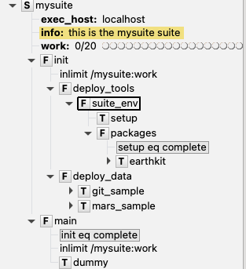

# Welcome to wellies documentation

Wellies provides extra features to help you build consistent and configurable
pyflow suites. This guide assumes a good level of familiarity with
[ecflow](https://ecflow.readthedocs.io) suites and using [pyflow](http://pyflow-workflow-generator.readthedocs.io) for its design and generation.
Please refer to these projects' documentation if some point about  them is not clear.

## Main features

- ***YAML*-based configuration** for your suites: wellies provides simple
patterns to help configuring your suite, making them more flexible and suitable for
different use cases and environments.
- Simple template to start your **suite design from scratch**: Don't get blocked
by a blank page; with `wellies-quickstart` starting to code a new workflow is
one command away.
- **Git-tracked suite deployment** from [tracksuite](https://github.com/ecmwf/tracksuite): Wellies comes fully integrated with tracksuite providing git-based
changes control for multi-users and remote deployment environments.
- **Extended *pyflow* nodes** for improved suite design, configuration and monitoring.
- **Template scripts** for improved reproducibility and support to D-R-Y design when it comes to scripting, like when dealing with datetime objects, *MARS* requests and others.

## Installation

Wellies is a pure python package, so installation from source is straightforward
with `pip`

```console
$ pip install pyflow-wellies
```

or for developers
```console
$ git clone git@github.com:ecmwf/pyflow-wellies.git
$ cd wellies
$ pip install -e .
```

## Quickstart

The quickest way to get familiar with wellies' features is using the
`wellies-quickstart` command-line tool to start a project from zero.

```python exec="true" id="quickstart-help"
import os,sys
sys.path.insert(0, os.environ['MKDOCS_CONFIG_DIR'])
from wellies.quickstart import get_parser
help_message=get_parser().format_help()
help_message = help_message.replace("mkdocs", "wellies-quickstart")
help_message = help_message.replace("__main__", "wellies-quickstart")
print(f"```\n{help_message}\n```")
```

To start a new project in a `projects` directory in your home folder, just run

```console
$ wellies-quickstart mysuite
```

This will create the following structure in your target project directory:

```tree
mysuite/
├── build.sh
├── configs
│   ├── data.yaml
│   ├── host.yaml
│   ├── tools.yaml
│   └── user.yaml
├── deploy.py
└── mysuite
    └── __init__.py
    └── config.py
    └── nodes.py
├── profiles.yaml
└── tests
    └── test_configs.py
```

Although it does not contain any meaningful task, this is already a **valid
defined ecFlow suite**. To deploy all of the suite's scripts and write its definition file, just run:

```console
$ ./build.sh user
running on host: localhost
------------------------------------------------------
Staging suite to /build_mysuite_y5r0ft9e
------------------------------------------------------
Generating suite:
    -> Deploying suite scripts in /tmp/build_mysuite_y5r0ft9e/staging
    -> Definition file written in /tmp/build_mysuite_y5r0ft9e/staging/mysuite.def
Creating deployer:
    -> Loading local repo /tmp/build_mysuite_y5r0ft9e/local
    -> Cloning from /perm/username/pyflow/mysuite
Changes in staged suite:
    - Removed:
        - dummy.txt
    - Added:
        - init/deploy_tools/deploy_tools.man
        - init/deploy_tools/suite_env/setup.ecf
        - init/deploy_tools/suite_env/earthkit.ecf
        - init/deploy_tools/suite_env/packages.man
        - init/deploy_data/git_sample.ecf
        - init/deploy_data/mars_sample.ecf
        - main/dummy.ecf
        - mysuite.def
For more details, compare the following folders:
/tmp/build_mysuite_y5r0ft9e/staging
/tmp/build_mysuite_y5r0ft9e/local
------------------------------------------------------
Deploying suite to /perm/username/pyflow/mysuite
------------------------------------------------------
You are about to push the staged suite to the target directory. Are you sure? (N/y)y
Could not find local git repository, using default message
Deploying suite to remote locations
    -> Checking that git repos are in sync
    -> Staging suite
    -> Git commit
    -> Git push to target /perm/username/pyflow/mysuite on host localhost
Suite deployed to /perm/username/pyflow/mysuite
Definition file: /perm/username/pyflow/mysuite/mysuite.def
```

After loading the suite on a running ecflow server, it will appear as following on the ecFlow UI.



This will provide a starting base for your suite. From there you can modify the
project and build your own workflow.

### Next

The [Tutorials](quickstart_guide.md) section contains further examples on suite
development from this base structure.

For details about how wellies can help configuring your suites, please check one of the [Suite Configuration](configurations.md) sections.
